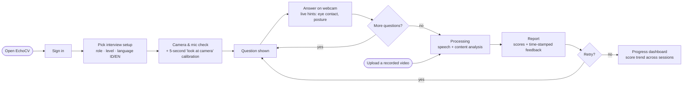
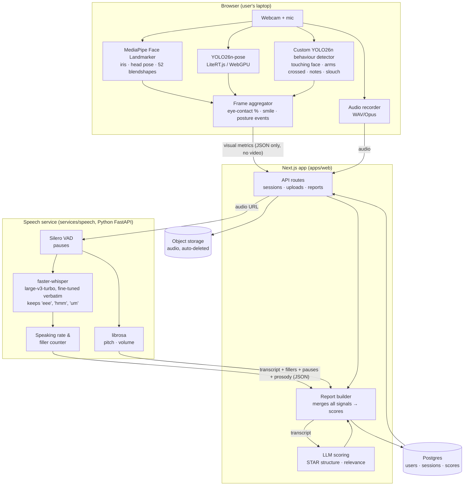
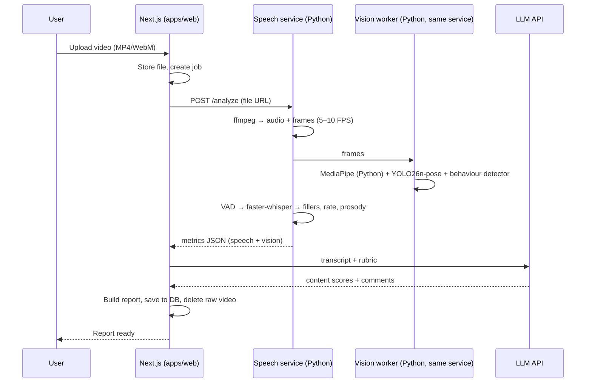
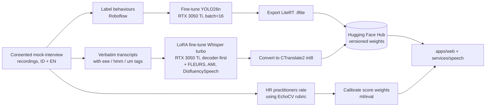

# EchoCV: architecture design

*Status: draft for team review · 6 October 2026*

EchoCV is an AI interview coach for Indonesian IT students and fresh graduates. It gives feedback on how a candidate delivers an answer in Indonesian or English: eye contact, posture, smile, filler words, pace, pauses and voice, plus the answer's content.

This document covers four things:
1. How the app works, from the user's view and the system's.
2. The tech stack.
3. The folder structure for a single repository.
4. The agent skills worth installing to build it faster.

All diagrams are Mermaid. They render as images on GitHub, in VS Code (with a Mermaid extension) and in most markdown viewers.

---

## 1. App workflow

### 1.1 User journey



There are two ways in:
- **Live mode:** the user practises on their webcam. Face and body are analysed in the browser in real time.
- **Upload mode:** the user uploads a recorded video. Everything is analysed on the server.

### 1.2 System data flow (live mode)



**Privacy:** in live mode, video never leaves the laptop. Only numbers (metrics) and the audio track go to the server, and stored audio is deleted after processing unless the user consents to it being used for training.

### 1.3 Upload mode



### 1.4 Model training loop (team side)



---

## 2. Tech stack

| Layer | Choice | Why | License |
|---|---|---|---|
| Frontend + light backend | **Next.js** (React, TypeScript, App Router) | One framework for UI and API routes | MIT |
| UI | Tailwind CSS + shadcn/ui | Fast, consistent components | MIT |
| Face analysis (browser) | **MediaPipe Face Landmarker** (`@mediapipe/tasks-vision`) | Eye contact (iris + head pose) and smile (blendshapes) with no training | Apache-2.0 |
| Body analysis (browser) | **YOLO26n-pose** via LiteRT.js (WebGPU); ONNX Runtime Web as fallback | Posture and gesture keypoints in real time | **AGPL-3.0** |
| Custom model (browser) | **YOLO26n detector** fine-tuned on our labelled frames | Touching face, arms crossed, reading notes, slouching | **AGPL-3.0** |
| Speech service | **Python 3.12 + FastAPI** (same version as Colab) | ML libraries are Python-native | MIT |
| Transcription | **faster-whisper** + **whisper-large-v3-turbo**, fine-tuned to keep fillers | Indonesian + English, word timestamps; stock Whisper drops fillers | MIT |
| Pauses | **Silero VAD** | Tiny, fast, multilingual | MIT |
| Voice | **librosa** (pYIN pitch, RMS volume) | Commercially safe (openSMILE is not) | ISC |
| Answer content | Hosted LLM (Gemini Flash-Lite class or GPT mini class); SEA-LION v4.5 as an open option | STAR structure and relevance scoring, Indonesian-capable | Vendor terms / MIT |
| Database | Postgres (Supabase or Neon) + Prisma | Users, sessions, scores | Apache-2.0 / MIT |
| File storage | Supabase Storage or S3-compatible bucket | Temporary audio and uploads, auto-delete | — |
| Auth | Auth.js (NextAuth) or Supabase Auth | Email / Google sign-in | ISC / Apache-2.0 |
| Model registry | Hugging Face Hub (private repos) | Versioned YOLO + Whisper weights | — |
| Labelling | Roboflow (free plan) for YOLO; Label Studio or spreadsheet for verbatim transcripts | Fast annotation | — |
| Training | Ultralytics and Hugging Face Transformers + PEFT/LoRA, both on the local RTX 3050 Ti (Whisper: frozen encoder, decoder LoRA, fits 4 GB) | Fits the hardware | AGPL-3.0 / Apache-2.0 |
| Deployment | Vercel (web); GPU VM or Hugging Face Space / Modal (speech service) | Cheap for a demo | — |
| Testing | Vitest (web unit), Playwright (end-to-end), pytest (speech service) | — | MIT / Apache-2.0 |

### 2.1 Why Python 3.12
- **Same version as Google Colab:** Colab runs Python 3.12, so notebooks used for training and the speech service behave the same.
- **Supported by the main libraries:** PyTorch, Ultralytics, faster-whisper and FastAPI all support 3.12.
- **Check in week 1:** MediaPipe's Python package tends to lag behind new Python versions. It's only needed for upload mode, so run `pip install mediapipe` on 3.12 early to confirm.
- **Avoid 3.13+ for now:** ML libraries often publish packages for the newest Python late.

### 2.2 What Hugging Face does in EchoCV
Hugging Face works like GitHub for AI models and datasets. EchoCV uses it for three jobs:

1. **Storing our trained models (the main reason).**
   - Weight files are too big for git; the fine-tuned Whisper alone is about 1.6 GB.
   - We upload the fine-tuned Whisper and custom YOLO models to private Hugging Face repos.
   - `services/speech` downloads Whisper at startup, and `apps/web` loads the YOLO `.tflite` from there.
   - Every upload is versioned, so a worse model can be rolled back.
2. **Downloading pretrained models and datasets.** Whisper large-v3-turbo, Indonesian Whisper checkpoints, Common Voice and FLEURS are all hosted there and download with one line of code.
3. **Storing interview recordings privately (optional).** A private Hugging Face dataset can hold the team's consented recordings outside git. Google Drive with restricted access is an alternative.

We also use its Transformers + PEFT libraries in Colab to fine-tune Whisper. The free tier covers all of this.

**License warning:** Ultralytics YOLO, including any weights you train with it, is AGPL-3.0. That's fine for a public competition repo. A closed-source commercial launch needs an Ultralytics Enterprise license or a swap to MediaPipe Pose / RTMPose.

---

## 3. Folder structure (single repository)

```
echocv/
├── apps/
│   └── web/                         # Next.js app: UI + API routes
│       ├── app/
│       │   ├── (marketing)/         # Landing page
│       │   ├── practice/            # Live interview session page
│       │   ├── upload/              # Upload-a-video page
│       │   ├── report/[id]/         # Report page
│       │   ├── dashboard/           # Progress over sessions
│       │   └── api/
│       │       ├── sessions/        # Create/finish session, receive visual metrics
│       │       ├── uploads/         # Signed upload URLs
│       │       └── reports/         # Merge signals, call LLM, save report
│       ├── components/              # UI components (shadcn/ui)
│       ├── lib/
│       │   ├── vision/              # Browser ML: MediaPipe + YOLO (LiteRT.js) wrappers
│       │   │   ├── faceLandmarker.ts
│       │   │   ├── yoloPose.ts
│       │   │   ├── behaviourDetector.ts
│       │   │   └── aggregator.ts    # Per-frame → per-answer metrics
│       │   ├── audio/               # Recorder, upload
│       │   ├── scoring/             # Combine metrics → scores (uses shared/rubric)
│       │   └── llm/                 # LLM client + prompts
│       ├── public/models/           # .tflite files (git-ignored; pulled from HF Hub)
│       ├── prisma/schema.prisma
│       └── tests/                   # Vitest + Playwright
│
├── services/
│   └── speech/                      # Python FastAPI service
│       ├── app/
│       │   ├── main.py              # /health, /analyze
│       │   ├── asr.py               # faster-whisper + filler extraction
│       │   ├── vad.py               # Silero VAD → pauses
│       │   ├── prosody.py           # librosa pitch/volume
│       │   ├── vision_offline.py    # Upload mode: MediaPipe + YOLO on frames
│       │   └── schemas.py           # Pydantic models (mirror shared/schemas)
│       ├── tests/                   # pytest
│       ├── pyproject.toml
│       └── Dockerfile
│
├── ml/
│   ├── yolo/                        # Custom behaviour detector
│   │   ├── build_dataset.py         # Roboflow seeds + COCO pose-rule crops → YOLO data
│   │   ├── train.py                 # yolo26n.pt fine-tune (local GPU)
│   │   ├── export.py                # → ONNX (local)
│   │   └── export_litert.ipynb      # → LiteRT (Colab: Linux only)
│   ├── whisper/                     # Verbatim filler fine-tune (local GPU)
│   │   ├── synth_id.py              # Synthetic Indonesian fillers on FLEURS
│   │   ├── prepare_data.py          # FLEURS + AMI + DisfluencySpeech (+ own data later)
│   │   ├── train_lora.py            # Decoder-first LoRA, fits 4 GB
│   │   └── merge_and_convert.py     # → CTranslate2 int8 for faster-whisper
│   ├── calibration/                 # Eye-contact and smile thresholds (MediaPipe)
│   ├── eval/                        # Score calibration vs HR ratings
│   └── data/                        # Download scripts only (datasets git-ignored)
│
├── shared/
│   ├── rubric.json                  # Score definitions & weights
│   ├── labels.json                  # Behaviour classes, filler tokens (eee, hmm, um…)
│   └── schemas/                     # JSON Schemas for metrics & reports
│
├── docs/
│   ├── tech-stack-and-datasets.md   # Research report
│   ├── data-collection-protocol.md  # How to record mock interviews
│   ├── consent-form.md              # Participant consent (ID + EN)
│   └── superpowers/specs/           # Design docs (this file)
│
├── .github/workflows/               # CI: lint + tests for web and speech
├── .gitignore                       # weights, datasets, recordings, .env
├── package.json, pnpm-workspace.yaml # pnpm workspace: apps/* + shared
├── .env.example                     # Variable names only, no secrets
└── README.md
```

**Local development runs natively, without Docker:** Next.js through pnpm and the speech service through uv, with a cloud Postgres. `services/speech/Dockerfile` is only for deployment.

**Never commit:**
- model weights (keep them on Hugging Face Hub)
- datasets or interview recordings (personal data)
- `.env` secrets

---

## 4. Agent skills for building EchoCV

These are skills for an AI coding agent (Claude Code or similar) that speed up the build. Each has a source, install count where found, and install command. Counts are from [skills.sh](https://skills.sh/) on 6 October 2026.

| Need | Skill | Source / installs | Install |
|---|---|---|---|
| Finding more skills later | `find-skills` | vercel-labs, 3.7M | `npx skills add vercel-labs/skills@find-skills` |
| Next.js / React performance and patterns | `vercel-react-best-practices` | vercel-labs, 770.7K | `npx skills add vercel-labs/agent-skills@vercel-react-best-practices` |
| Component architecture | `vercel-composition-patterns` | vercel-labs, 374.0K | `npx skills add vercel-labs/agent-skills@vercel-composition-patterns` |
| UI quality and accessibility | `web-design-guidelines` | vercel-labs, 700.6K | `npx skills add vercel-labs/agent-skills@web-design-guidelines` |
| Distinctive UI design | `frontend-design` | anthropics, 954.0K | `npx skills add anthropics/skills@frontend-design` |
| Database | `supabase-postgres-best-practices` | supabase, 431.6K | `npx skills add supabase/agent-skills@supabase-postgres-best-practices` |
| ORM | Prisma skills | prisma, ~330K each | `npx skills find prisma` and pick the schema/migrate skill |
| Python speech API | `fastapi` (Pydantic v2, async) | jezweb/claude-skills, ~2K installs, 1K★ | `npx skills add https://github.com/jezweb/claude-skills --skill fastapi` |
| Tests first | `tdd` | mattpocock, 1.0M | `npx skills add mattpocock/skills@tdd` |
| Planning before coding | `brainstorming`, `writing-plans`, `test-driven-development` | obra/superpowers, 241.6K (TDD) | `npx skills add obra/superpowers` |
| Hugging Face Hub (upload/download weights) | `huggingface-cli` | huggingface/skills (4.2K★) | see [github.com/huggingface/skills](https://github.com/huggingface/skills) |

**Not found:** skills for YOLO/Ultralytics, MediaPipe, Whisper fine-tuning or computer vision in general. The leaderboard focuses on web development. For these, rely on the official docs linked in `docs/tech-stack-and-datasets.md`.

**Hugging Face's `hugging-face-model-trainer` is not a fit.** It targets LLM training with TRL on paid Hugging Face Jobs, not Whisper LoRA on free Colab.

**Install caution:** prefer skills from official publishers (vercel-labs, anthropics, supabase, prisma, huggingface). Read the SKILL.md of smaller community skills before installing.

---

## 5. Open decisions for the team
1. **Database/auth provider.** Supabase (DB + auth + storage in one) is recommended for speed.
2. **Hosting for the speech service.** For the demo: a GPU VM, or your laptop exposed through a tunnel. CPU-only int8 is slower but works.
3. **Licensing path.** Keep the repo public (AGPL-compliant) for the competition; decide on an Ultralytics Enterprise license versus MediaPipe Pose before any commercial launch.

---

## Sources
- [skills.sh leaderboard](https://skills.sh/)
- [jezweb FastAPI skill](https://skills.sh/jezweb/claude-skills/fastapi)
- [Hugging Face skills repo](https://github.com/huggingface/skills)
- [Hugging Face model trainer skill](https://www.mdskills.ai/skills/hugging-face-model-trainer)
- Tech-stack sources: see `docs/tech-stack-and-datasets.md`
